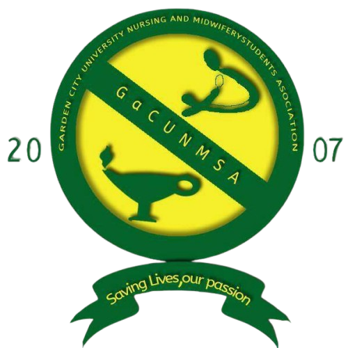

# Garden City University Nursing & Midwifery Students' Association (GaCUNMSA)



## Overview
Welcome to the official website repository for the Garden City University Nursing & Midwifery Students' Association (GaCUNMSA). This platform serves as the digital hub for students, faculty, and visitors to access information about our programs, events, and activities.

## Features

- **Responsive Design**: Fully responsive layout that works on all devices
- **Modern UI/UX**: Clean and intuitive user interface with smooth animations
- **Interactive Gallery**: Photo gallery showcasing events and activities
- **Event Management**: Upcoming events and registration
- **Program Information**: Detailed descriptions of academic programs
- **Contact Form**: Easy way to get in touch with the association

## Technologies Used

- **Frontend**:
  - HTML5, CSS3, JavaScript
  - [Bootstrap 5.3](https://getbootstrap.com/)
  - [Font Awesome 6](https://fontawesome.com/)
  - [AOS (Animate On Scroll)](https://michalsnik.github.io/aos/)
  - [Lightbox2](https://lokeshdhakar.com/projects/lightbox2/)
  - [Slick Carousel](https://kenwheeler.github.io/slick/)

## Getting Started

### Prerequisites
- A modern web browser (Chrome, Firefox, Safari, Edge)
- Code editor (VS Code, Sublime Text, etc.)
- Git (for version control)

### Installation
1. Clone the repository:
   ```bash
   git clone https://github.com/yourusername/gacunmsa-website.git
   ```
2. Navigate to the project directory:
   ```bash
   cd gacunmsa-website
   ```
3. Open `index.html` in your browser to view the website locally.

## Project Structure

```
gacunmsa-website/
├── assets/
│   ├── css/
│   │   ├── style.css
│   │   ├── back-to-top.css
│   │   ├── gallery.css
│   │   └── slider.css
│   ├── js/
│   │   ├── main.js
│   │   ├── back-to-top.js
│   │   ├── gallery.js
│   │   └── slider.js
│   └── images/
│       ├── logo.png
│       ├── uni-logo.jpg
│       └── ...
├── index.html
├── about.html
├── programs.html
├── events.html
├── gallery.html
├── contact.html
└── README.md
```

## Contributing

We welcome contributions from the community! To contribute:

1. Fork the repository
2. Create a new branch for your feature (`git checkout -b feature/amazing-feature`)
3. Commit your changes (`git commit -m 'Add some amazing feature'`)
4. Push to the branch (`git push origin feature/amazing-feature`)
5. Open a Pull Request

## License

This project is licensed under the MIT License - see the [LICENSE](LICENSE) file for details.

## Acknowledgments

- [Bootstrap](https://getbootstrap.com/) for the responsive framework
- [Font Awesome](https://fontawesome.com/) for the icons
- [AOS](https://michalsnik.github.io/aos/) for scroll animations
- [Lightbox2](https://lokeshdhakar.com/projects/lightbox2/) for the image gallery

## Contact

For any inquiries, please contact us at [info@gacunmsa.edu.gh](mailto:info@gacunmsa.edu.gh)

---

© 2025 GaCUNMSA - Garden City University Nursing & Midwifery Students' Association
